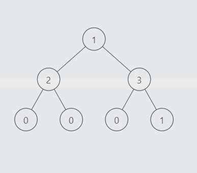

# PROBLEM STATEMENT

You are given the root of a binary tree with n nodes where each node in the tree has node.val coins. There are n coins in total throughout the whole tree.

In one move, we may choose two adjacent nodes and move one coin from one node to another. A move may be from parent to child, or from child to parent.

Return the minimum number of moves required to make every node have exactly one coin.

# EXAMPLE

Input: root = [3,0,0]
Output: 2
Explanation: From the root of the tree, we move one coin to its left child, and one coin to its right child.

# APPROACH

The idea is that for any node, there are two possibilities - Either it will give a value to another node or it will take a value from another node. In either case, one move will happen.

Since it is given that sum of all node values in any test case will be equal to "n", or the number of nodes, it means, for any tree with root as "root", if we know how much excess coins are on left and right, we can then easily find how many moves will be needed to make sure each node has 1 coin.

Suppose we have the above binary tree.

When we are at the root node, we see that on the left side, there are three nodes. But, the total sum of values on left is 2 + 0 + 0 => 2.

What does it mean? It means that on the left side, there are more nodes than coins so it means one coin will have to be passed to the left subtree so that there are equal nodes and coins. Similarly, we see that on the right side, there are four coins but only three nodes. It means there is an extra 1 coin on the right side which can be passed over to the root and then the root will pass it over to the left side.

But, we see that this alone is not enough. Because as per above logic, only two moves are required. One to pass one coin from root to left and one to pass one coin from right subtree to root. But if we see, it will definitely take more than two moves.

And so, it means, we have to start checking from the leaf nodes first, and then finally come to the root node. In other words, we will do a Post Order traversal.

So, let's do a Post Order Traversal.

We start from the leftmost leaf node "0"? On its left, there are no nodes and on its right there are no nodes. So, no distribution is needed here. Same for the second leaf node.

But, when we are at the node with value "2", then this subtree has one node on left and one node on right. But we see that the sum of values on the left is 0 and the sum of values on the right is also 0. It means, we need to pass one coin each for left and right nodes.

And to pass two coins, it will require two moves. And once we do that, the leaf nodes on the left subtree both have a value "1" (We won't actually update the values of the nodes in the code, though).

Now, let's come to the right subtree's leaf nodes. Again, the same story for the first leaf node but the second already has a value "1". It means, when we are at the node with value "3", we see that on left, there is one node but total sum is 0. It means there is a need of 1 coin on left. But, on right, there is 1 node and total sum is also 1. This means, the right side doesn't need any coins.

And so, it means, only one move is required here to pass one coin to the left side.

Now, we come to the root node "1". We see on left side, there are three nodes and total sum is 2. It means, one coin needs to be passed on to left subtree. So, it will require one move.

And on right side, there are three nodes and total sum is 4. It means, one coin needs to be passed from right subtree back to the root and this will also require one move. 

So finally, we see that the minimum number of moves needed is 5.

From this example, we can see that if left subtree requires "x" nodes and right subtree has extra "y" nodes, then the moves required will be x + y.

So, all we need to know is how many nodes are in excess or deficit on left and right side. We just have to update the moves by their sum.