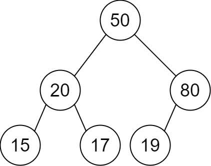

# PROBLEM STATEMENT

You are given a 2D integer array descriptions where descriptions[i] = [parenti, childi, isLefti] indicates that parenti is the parent of childi in a binary tree of unique values. Furthermore,

 - If isLefti == 1, then childi is the left child of parenti.
 - If isLefti == 0, then childi is the right child of parenti.

Construct the binary tree described by descriptions and return its root.

The test cases will be generated such that the binary tree is valid.

# EXAMPLE

Input: descriptions = [[20,15,1],[20,17,0],[50,20,1],[50,80,0],[80,19,1]]
Output: [50,20,80,15,17,19]
Explanation: The root node is the node with value 50 since it has no parent.
The resulting binary tree is shown in the diagram.

# APPROACH

The idea is very simple.

We will have a dictionary that keeps the data about the node values and the respective nodes. As we iterate over the descriptions list, we will update the dictionary accordingly. And after that, all we need is to find what is the root node's value. From that, we can get the entire tree from the dictionary and return it.