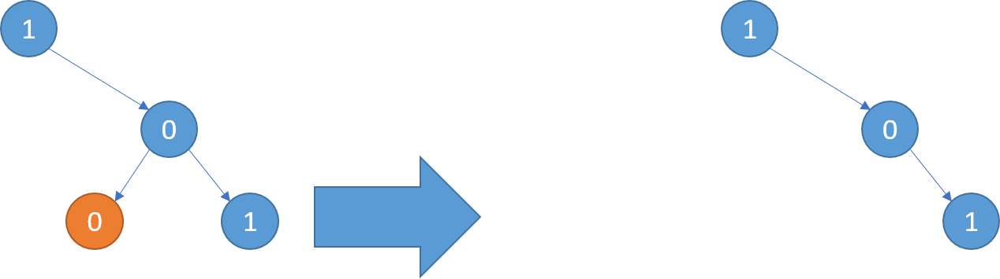

# PROBLEM STATEMENT

Given the root of a binary tree, return the same tree where every subtree (of the given tree) not containing a 1 has been removed.

A subtree of a node node is node plus every node that is a descendant of node.

# EXAMPLE

Explanation: 
Only the red nodes satisfy the property "every subtree not containing a 1".
The diagram on the right represents the answer.

# APPROACH

The idea is the simple. Our recursive "dfs" function will take the node of a tree and return whether that tree has to be pruned or not. We decide this by checking if the tree has not even a single "1". At the end, we will get the final tree.

Just note that in the test cases where the entire tree has to be pruned, we have to also add an extra check after we call this recursive function in the "pruneTree" function. If this recursive function returns a False, it basically means in the entire tree, there is not even a single "1" so this entire tree needs to be pruned.