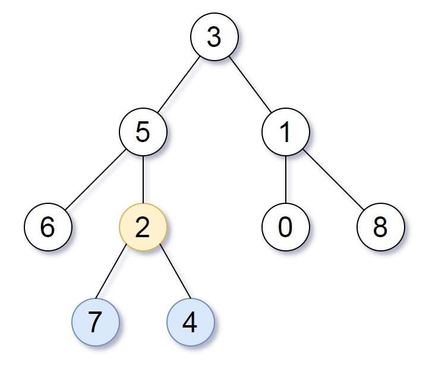

# PROBLEM STATEMENT

Given the root of a binary tree, return the lowest common ancestor of its deepest leaves.

Recall that:

 - The node of a binary tree is a leaf if and only if it has no children
 - The depth of the root of the tree is 0. if the depth of a node is d, the depth of each of its children is d + 1.
 - The lowest common ancestor of a set S of nodes, is the node A with the largest depth such that every node in S is in the subtree with root A.
  
# EXAMPLE

Output: [2,7,4]
Explanation: We return the node with value 2, colored in yellow in the diagram.
The nodes coloured in blue are the deepest leaf-nodes of the tree.
Note that nodes 6, 0, and 8 are also leaf nodes, but the depth of them is 2, but the depth of nodes 7 and 4 is 3.

# APPROACH

This problem is an extension of the problem - "Lowest Common Ancestor of the Binary Tree". In that problem, we had given two nodes and we had to return the lowest common ancestor of those two nodes.

But here, we have to manually find the deepest leaf nodes and then return the lowest common Ancestor of those nodes.

Now, if you think about it, if we know the first and last nodes in the deepest level of the tree, then from those two nodes, we can easily find the LCA.

If you didn't understand why we are taking only first and last node, just imagine if in the above binary tree, we did not have "7" and "4" in the last level. It means, what if the last level was the one with four nodes in it -> 6 , 2 , 0 and 8?

In that case as well, since these are the deepest four leaf nodes, all we need to consider is what is the node that is the lowest common ancestor of the nodes "6" and "8". That would be lowest common ancestor of all the deepest leaf nodes.

And that's the whole idea.

So, one extra step is to find the first and last nodes in a binary tree's last level and then just reuse the LCA code from the problem "Lowest Common Ancestor of a Binary Tree".

Ofcourse there can be a case where there is only one leaf node at the last level. Then it means it is the first as well as the last node.