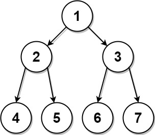

# PROBLEM STATEMENT

Given two integer arrays, preorder and postorder where preorder is the preorder traversal of a binary tree of distinct values and postorder is the postorder traversal of the same tree, reconstruct and return the binary tree.

If there exist multiple answers, you can return any of them.

# EXAMPLE

Input: preorder = [1,2,4,5,3,6,7], postorder = [4,5,2,6,7,3,1]
Output: [1,2,3,4,5,6,7]

# APPROACH

The idea is the same as these problems - 

1. [105. Construct Binary Tree from Preorder and Inorder Traversal](https://leetcode.com/problems/construct-binary-tree-from-preorder-and-inorder-traversal/)
2. [106. Construct Binary Tree from Inorder and Postorder Traversal](https://leetcode.com/problems/construct-binary-tree-from-inorder-and-postorder-traversal/)

Basically, we have a recursive function that takes the preorder and postorder lists as input, along with the start and end pointers for the current tree. Now, it is not very easy to explain how we update these pointers but it will be very easy if you take a couple of examples and then do a dry run.

Let's take the example given in the problem.

	preorder = [1,2,4,5,3,6,7], postorder = [4,5,2,6,7,3,1]
	
	Now, we know preorder is "Root -> Left -> Right"
	And, postorder is "Left -> Right -> Root"
	
	And that's why the root node with value "1" is at the beginning in preorder list
	and at the end in the postorder list.
	
	We will use our preorder list to construct nodes. 
	
	At any time when we call the "build" function, the index "preStart" will be the index of the root of that tree.
	
	Initially,
	
	preStart = 0
	preEnd = n - 1
	postStart = 0
	postEnd = n - 1
	
	Now, the main logic begins in the build function.
	
	We see the preStart = 0. So, value of the root node for current tree is value at index 0 in preorder list.
	
	That is, root node has a value "1".
	
	Now, we want to make recursive calls for the left and right subtrees.
	
	But, for those calls, we need to correctly update the pointer values. 
	And this is something that you can figure out only by going over a few examples.
	
	Since preorder is "Root -> Left -> Right"
	
	And we already found the root node as the first value in the preoder list.
	
	preorder = [1,2,4,5,3,6,7]
	
	It means, the rest of the values are now the values of left and right subtrees.
	
	But, we now need to divide the list in two parts so that we assign one part for left subtree
	and the other part for the right subtree.
	
	We can see from the image above that for the left subtree of the root {1}, preorder should be [2,4,5]
	And for the right subtree, preorder traversal should be [3,6,7]
	
	It means, the list [1,2,4,5,3,6,7] should be divided as [2,4,5] and [3,6,7] for left and right subtrees.
	
	Ofcourse we won't actually divide it and that's why we have the pointers to keep track of start and end indices.
	
	So, for the left subtree, since preorder list is [2,4,5], it means for it, preStart = 1 and preEnd = 3.
	
	But, how do we figure that our programmatically?
	
	It is easy to know the preStart as it will just be previous preStart + 1
	But what about preEnd?
	
	Well, if we know how many nodes the left subtree has, then we can just do preStart + count of nodes on left side + 1
	
	How can we know the count?
	
	And that's where we have to incorporate a hash table into the solution. 
	This hash table will have a mapping for the values and their indices in the post order list.
	
	The post order for above image is [4,5,2,6,7,3,1]
	
	We know that for left subtree, the root is "2".
	
	Now, we see that "2" is actually at the index "2" in the postorder list.
	
	Since post order is a Left -> Right -> Root traversal,
	it means all the nodes on the left of the value "2" 
	and on the right of postStart (including itself) in postorder should be the part of left subtree.
	
	In other words, the left subtree has "3" nodes in total.
	
	And that's how we get the leftCount as 3.
	
	So, now that we have the leftCount, we can now update the pointers accordingly.
	
	So, for the left subtree -
	
		preStart = 1
		preEnd = 3
		postStart = 0
		postEnd = 2
		
	And for the right subtree - 
	
		preStart = 4
		preEnd = 6
		postStart = 3
		postEnd = 5
		
And this is the main idea. Ofcourse there will be some edge cases which you can identify as you take more examples and do a dry run.