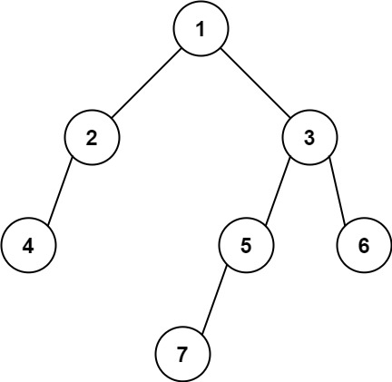

# PROBLEM STATEMENT

Given the root of a binary tree, return the leftmost value in the last row of the tree.

# EXAMPLE

Output = 7

# 1. BFS -> LEFT TO RIGHT

The first approach is very simple. Just traverse the tree in the BFS order and in this way, as we traverse each level from left to right, we know that the leftmost value in the level may be the leftmost value of last row. So, we will keep updating the leftmost node value. And in this way, at the end, we will have the leftmost value in the last row of the tree.

# 2. BFS -> RIGHT TO LEFT

What if we traverse the levels from right to left? In this case, we know that the node that we will traverse last is the leftmost node in the last row of the tree. And based on this, we can also have a BFS solution where we first push the right child in the node and then the left child.