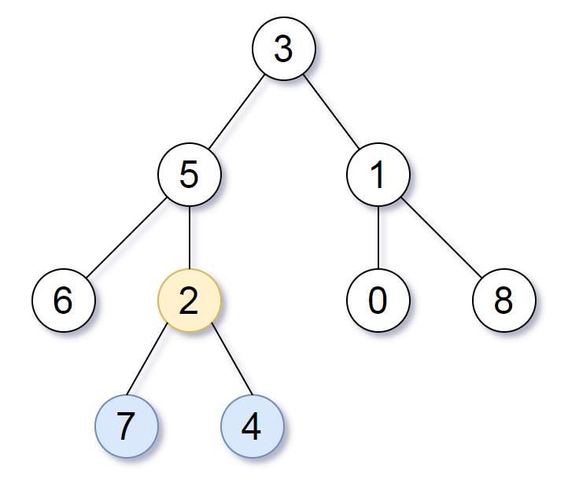

# PROBLEM STATEMENT

Given the root of a binary tree, the depth of each node is the shortest distance to the root.

Return the smallest subtree such that it contains all the deepest nodes in the original tree.

A node is called the deepest if it has the largest depth possible among any node in the entire tree.

The subtree of a node is a tree consisting of that node, plus the set of all descendants of that node.

# EXAMPLE

Output: [2,7,4]
Explanation: We return the node with value 2, colored in yellow in the diagram.

The nodes coloured in blue are the deepest nodes of the tree.
Notice that nodes 5, 3 and 2 contain the deepest nodes in the tree but node 2 is the smallest subtree among them, so we return it.

# APPROACH

The problem is the same as [1123. Lowest Common Ancestor of Deepest Leaves](https://leetcode.com/problems/lowest-common-ancestor-of-deepest-leaves/)

