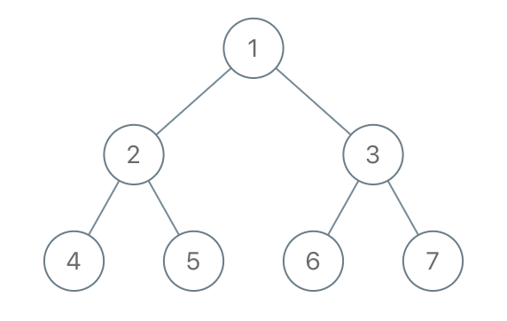

# PROBLEM STATEMENT

Given the root of a binary tree, each node in the tree has a distinct value.

After deleting all nodes with a value in to_delete, we are left with a forest (a disjoint union of trees).

Return the roots of the trees in the remaining forest. You may return the result in any order.

# EXAMPLE

Input: root = [1,2,3,4,5,6,7], to_delete = [3,5]
Output: [[1,2,null,4],[6],[7]]

# APPROACH

The idea is that, as we reach a node that has to be removed, we have to let its parent know (if it exists) that this node has been deleted. It means, if the deleted node was the left child of the parent, then we need to do "parent.left = None" to simulate the deletion of the node. And vice versa for the right child.

Then, since we know that the node has been deleted, if there is a left child or a right child, then those will now form two separate trees. And to keep track of such separate trees, we can use a set named "rootNodes".

Why a set? Because later, if the nodes that we added as roots of some trees are also removed, then we can remove them from this set in O(1) time.

And finally, this set will contain all the separate root nodes that we have to return as a list.