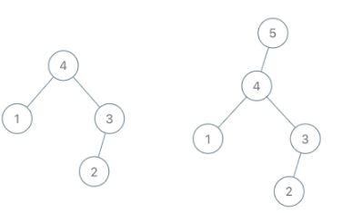
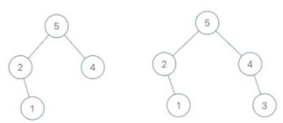
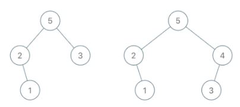

# PROBLEM STATEMENT

A maximum tree is a tree where every node has a value greater than any other value in its subtree.

You are given the root of a maximum binary tree and an integer val.

Just as in the previous problem, the given tree was constructed from a list a (root = Construct(a)) recursively with the following Construct(a) routine:

    - If a is empty, return null.
    - Otherwise, let a[i] be the largest element of a. Create a root node with the value a[i].
    - The left child of root will be Construct([a[0], a[1], ..., a[i - 1]]).
    - The right child of root will be Construct([a[i + 1], a[i + 2], ..., a[a.length - 1]]).
    - Return root.

Note that we were not given a directly, only a root node root = Construct(a).

Suppose b is a copy of a with the value val appended to it. It is guaranteed that b has unique values.

Return Construct(b).

# EXAMPLE

Input: root = [4,1,3,null,null,2], val = 5
Output: [5,4,null,1,3,null,null,2]
Explanation: a = [1,4,2,3], b = [1,4,2,3,5]

# APPROACH

The problem description is bad. Simple as that.

Here is what the problem actually wants us to do.

See, in the "**[Maximum Binary Tree](https://leetcode.com/problems/maximum-binary-tree/)**" problem, we had given a list and from that list, we had to create a maximum binary tree such that the root of any subtree has the maximum value among all its child nodes.

Here, we are given a "val" which is a value that we have to insert in the given tree and this given tree is a Maximum Binary Tree by default. 

At the very end of the problem description, it says - 

	Suppose b is a copy of a with the value val appended to it.
	
Here, "a" is nothing but the initial list that we would've received in the "Maximum Binary Tree" problem. So, it says that assume we are given the same list, but just with the "val" at the end of it. Then, we just have to return the Maximum Binary Tree that will be generated out of that list.

And that's the whole problem.

Make sure you have done the  "**[Maximum Binary Tree](https://leetcode.com/problems/maximum-binary-tree/)**" problem otherwise it won't be very easy to understand the intiuition.

Suppose, we are given root = [4,1,3,null,null,2], val = 5

Now, no matter what the left looked like for the left tree, since we know that the "val" is added at the end of this list, what does it mean? 

 1. Either it is the right child of some previous node in the list
 2. Or, some node on its left is its left child

Because, these are the only two scenarios possible. It is also possible that this "val" is the greatest value in the entire list (like in above example). And even in that case, the situation (2) above is the one that will happen. That is, the root node will be the left child of this new node in that case.

And that's exactly what happens in above example as we can see.

root = [5,2,4,null,1], val = 3

What if have the above example?

Here, we see that the val "3" is not greater than the root node "5". It means, it must be part of the right subtree only because remember that the "val" is added to the end of the list. It means, it just cannot be the left child of any node at all. This is a very important observation and this is something you can make only if you have done the "**[Maximum Binary Tree](https://leetcode.com/problems/maximum-binary-tree/)**" problem.

So, we then look at the right subtree. The root of right subtree is "4". But again, "4" is not smaller than "3". So, we continue. And we are done with the traversal. Since we did not add it anywhere between 5 and 4, it means that this node with value "3" will be the rightmost node of right subtree of root. And that's how we get the resulting tree.

root = [5,2,3,null,1], val = 4

Let's take one final example where we add the node in between.

Here, we have a value as "4". So, when we are at "5", we see that 5 is not less than 4 so we traverse right. Now, we see that "3" is smaller than "4". What does it mean? It means that the subtree with root "3" should be the left child of this new node "4".

And so, we will attach the subtree with root "3" to the left of node "4" and return this new node. And finally, we make this node as the right child of node "5".

And that's the whole idea.