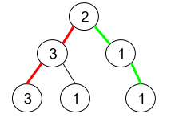

# PROBLEM STATEMENT

Given a binary tree where node values are digits from 1 to 9. A path in the binary tree is said to be pseudo-palindromic if at least one permutation of the node values in the path is a palindrome.

Return the number of pseudo-palindromic paths going from the root node to leaf nodes.

# EXAMPLE

Input: root = [2,3,1,3,1,null,1]
Output: 2 

Explanation: The figure above represents the given binary tree. There are three paths going from the root node to leaf nodes: the red path [2,3,3], the green path [2,1,1], and the path [2,3,1]. Among these paths only red path and green path are pseudo-palindromic paths since the red path [2,3,3] can be rearranged in [3,2,3] (palindrome) and the green path [2,1,1] can be rearranged in [1,2,1] (palindrome).

# APPROACH

The idea is that a path will be pseudo-palindromic if there is at most one value in the path that exists odd number of times. That is, either there are 0 values or 1 value that exists odd number of times.

And to keep track of this odd count, we can create a set that will keep the values that occur odd number of times in current path.

Then, when we reach the leaf node, we just need to check if the size of the set is 0 or 1. If yes, then current path is palindromic.

And since we are dealing with frequencies here, we also need to keep track of them using a dictionary / hash table.