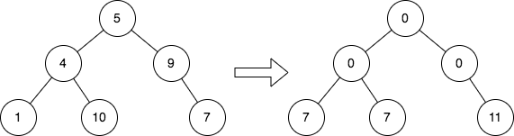

# PROBLEM STATEMENT

Given the root of a binary tree, replace the value of each node in the tree with the sum of all its cousins' values.

Two nodes of a binary tree are cousins if they have the same depth with different parents.

Return the root of the modified tree.

Note that the depth of a node is the number of edges in the path from the root node to it.

# EXAMPLE

Explanation: The diagram above shows the initial binary tree and the binary tree after changing the value of each node.
- Node with value 5 does not have any cousins so its sum is 0.
- Node with value 4 does not have any cousins so its sum is 0.
- Node with value 9 does not have any cousins so its sum is 0.
- Node with value 1 has a cousin with value 7 so its sum is 7.
- Node with value 10 has a cousin with value 7 so its sum is 7.
- Node with value 7 has cousins with values 1 and 10 so its sum is 11.

The idea is to first traverse the tree to get the sum of all the nodes in each level.

Then, traverse the tree again, this time, using the data that we got in the first traversal to set the node values correctly.

For any node, its cousins are all the other nodes in that level that are not having the same parent as itself. If two nodes have the same parent, then they are not cousins. In that case, they are called siblings.

So, for any node, the new value will be - 

	Total Sum of the level - (Sum of itself + sum of its sibling)
	
# **BFS APPROACH**
	
So, as we put each node in the queue, we will also make sure to put the value of its sibling in the queue (0, if the sibling does not exist). In this way, at any point, we can quickly get the sum of the node and its subling that we have to subtract from the total sum of the current level.

# **DFS APPROACH**

Just as in the BFS approach, we will pass the sibling value in the recursive call to each node.