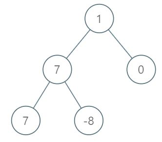

# PROBLEM STATEMENT

Given the root of a binary tree, the level of its root is 1, the level of its children is 2, and so on.

Return the smallest level x such that the sum of all the values of nodes at level x is maximal.

# EXAMPLE

Input: root = [1,7,0,7,-8,null,null]
Output: 2

Explanation: 
Level 1 sum = 1.
Level 2 sum = 7 + 0 = 7.
Level 3 sum = 7 + -8 = -1.
So we return the level with the maximum sum which is level 2.

# APPROACH

We just need to keep track of the sum of each level and in the end, return the level that has the maximum sum. In case of BFS traversal, since we traverse the tree level-wise, we can get the sum of the entire level in one iteration. But, in case of DFS, we may not necessarily traverse the entire level at once so we have to first get the sum of all the levels, and then get the level with the maximum sum out of those.