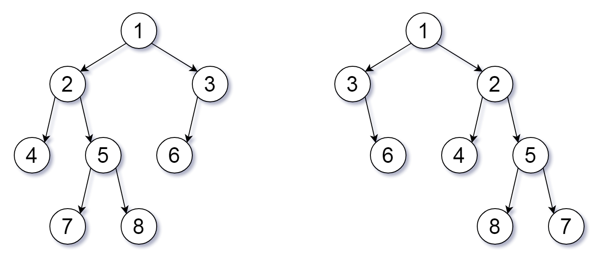

# PROBLEM STATEMENT

For a binary tree T, we can define a flip operation as follows: choose any node, and swap the left and right child subtrees.

A binary tree X is flip equivalent to a binary tree Y if and only if we can make X equal to Y after some number of flip operations.

Given the roots of two binary trees root1 and root2, return true if the two trees are flip equivalent or false otherwise.

# EXAMPLE

Output: true
Explanation: We flipped at nodes with values 1, 3, and 5.

# APPROACH

We will simply compare the nodes of the two trees.

Since we know that nodes might be flipped, it means, the "left" child of root1 will either be same as the "left" child of root2 or it will be the same as the "right" child of root2.

And the same for the "right" child of root2.

And that's why, in the Recursive DFS solution, we have these calls - 

	self.flipEquiv(root1.left, root2.left) or self.flipEquiv(root1.left, root2.right)
							and
	self.flipEquiv(root1.right, root2.right) or self.flipEquiv(root1.right, root2.left)
	
The first line is for comparng the left child of root1, and the second line is for comparing the right child of root1.