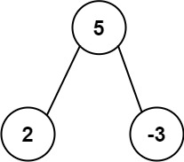

# PROBLEM STATEMENT

Given the root of a binary tree, return the most frequent subtree sum. If there is a tie, return all the values with the highest frequency in any order.

The subtree sum of a node is defined as the sum of all the node values formed by the subtree rooted at that node (including the node itself).

# EXAMPLE

Output: [2,-3,4]

# APPROACH

The "getSubtreeSum" function will take the "root" as input and give us the sum of the subtree rooted at "root".

So, we can recursively call it to get the sum of left and right subtrees, put the sum values in a dictionary with their frequencies, and then return back the sum of the entire tree at the end and also put that in the dictionary.

In this way, when this function is done, we will have a dictionary that has keys as the sums, and the values as the frequency of those sums.

Out of those, we simply need to return all the sums that have the maximum frequency.