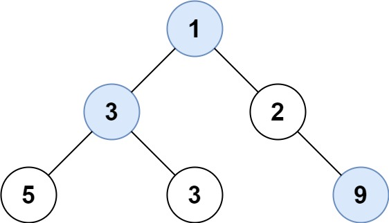

# PROBLEM STATEMENT

You are given the root of a binary tree containing digits from 0 to 9 only.

Each root-to-leaf path in the tree represents a number.

  - For example, the root-to-leaf path 1 -> 2 -> 3 represents the number 123.
  
Return the total sum of all root-to-leaf numbers. Test cases are generated so that the answer will fit in a 32-bit integer.

A leaf node is a node with no children.

# EXAMPLE

Output: 1026
Explanation:
The root-to-leaf path 4->9->5 represents the number 495.
The root-to-leaf path 4->9->1 represents the number 491.
The root-to-leaf path 4->0 represents the number 40.
Therefore, sum = 495 + 491 + 40 = 1026.

# APPROACH

The idea is simple. All we need to do is keep track of the number from root to a specific node. And once we reach a leaf node, we just need to add that number to the total sum so far.

Suppose we have the above tree.

When we start from the root node "1", then the numbe so far is "1".

Now, let's say we traverse left and reach the node with value 3. Now, we know that the number should be "13". So, we can get that in the code by doing - 

	(1 * 10) + 3 => 13
	
That is, 
	
	(numSoFar * 10) + root.val
	
Again, we traverse left and reach the node with value "5". So, the number becomes "135"

And finally, we see that "5" is a leaf node hence "135" is added to the final sum.

And we do this with all the nodes and finally, we get the total sum as 135 + 133 + 129 => 397