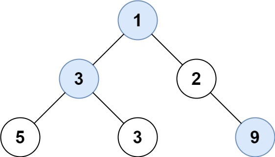

# PROBLEM STATEMENT

Given the root of a binary tree, return an array of the largest value in each row of the tree (0-indexed).

# EXAMPLE

Output: [1,3,9]

# APPROACH

Pretty straightforward approach. Just keep track of the maximum element in each row and in the end put that max element in the output list when we are done traversing the row. Finally, return the output list.

