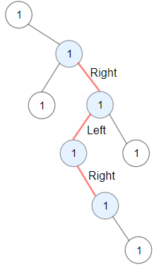
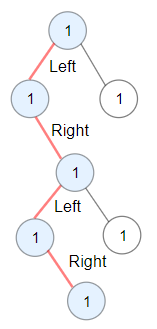

# PROBLEM STATEMENT

You are given the root of a binary tree.

A ZigZag path for a binary tree is defined as follow:

 - Choose any node in the binary tree and a direction (right or left).
 - If the current direction is right, move to the right child of the current node; otherwise, move to the left child.
 - Change the direction from right to left or from left to right.
 - Repeat the second and third steps until you can't move in the tree.

Zigzag length is defined as the number of nodes visited - 1. (A single node has a length of 0).

Return the longest ZigZag path contained in that tree.

# EXAMPLE

Output: 3
Explanation: Longest ZigZag path in blue nodes (right -> left -> right).

# APPROACH

Let's say we have the above binary tree as input.

When we start from the Root node, we can either traverse left or right. And in either case, a new zig-zag path will start because we are starting from the root node.

This means, we need to keep track of the number of nodes visited for both the paths, hence the "nodesCount" argument is used in the recursive function for that. We also need to keep track of the next "direction" to move towards so as to continue moving on the current zig-zag path. Hence, the "moveLeft" argument is used for that. If this "moveLeft" flag is True, it means we have to move towards left child to continue moving on the current path. If we move towards right in this case, then a new path will start from current node.

So, from the root, we will make a recursive call like this  -

	dfs(root.left, longestPath, False, 1)
	and
	dfs(root.right, longestPath, True, 1)
	
It means, traverse left and from the left child, we have to move right to continue on the current zig-zag path. Similarly, traverse right and from the right child, we have to move left to continue on the current zig-zag path.

So, let's say we reach the left node. Now, at this point, we will have "moveLeft" as False. This means, when we traverse right, we continue on the same path hence we keep using the same "nodesCount" value that we get as input. 

But, that is not the case if we traverse left. If we traverse left (In above input, there is no left child of this node but just assume if there was), then a new path will start from the current node, and that is why we reset the "nodesCount" to "1".

And that's the whole idea.
