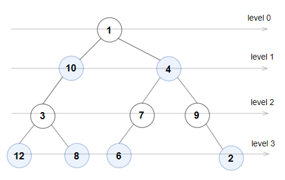

# PROBLEM STATEMENT

A binary tree is named Even-Odd if it meets the following conditions:

 - The root of the binary tree is at level index 0, its children are at level index 1, their children are at level index 2, etc.
 - For every even-indexed level, all nodes at the level have odd integer values in strictly increasing order (from left to right).
 - For every odd-indexed level, all nodes at the level have even integer values in strictly decreasing order (from left to right).

Given the root of a binary tree, return true if the binary tree is Even-Odd, otherwise return false.

# EXAMPLE

Output: true
Explanation: The node values on each level are:
Level 0: [1]
Level 1: [10,4]
Level 2: [3,7,9]
Level 3: [12,8,6,2]
Since levels 0 and 2 are all odd and increasing and levels 1 and 3 are all even and decreasing, the tree is Even-Odd.

# APPROACH

Since the problem wants us to check nodes at each level, it is not hard to guess that BFS (Level Order Traversal) will be used in this problem.

We just need to follow the same template that we use for BFS with just a few extra steps. We need to keep track of the level that we are at, and then, we have to make sure all the conditions mentioned in the problem are valid for current node in current level. If not, we can straight away return False.

Otherwise, the binary tree is an even-odd tree.