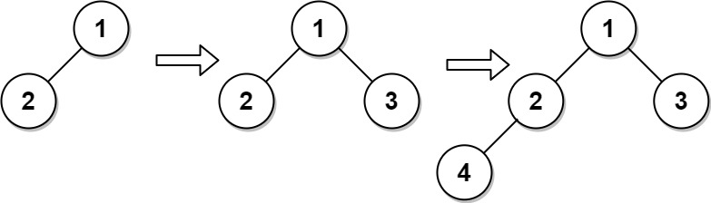

# PROBLEM STATEMENT

A complete binary tree is a binary tree in which every level, except possibly the last, is completely filled, and all nodes are as far left as possible.

Design an algorithm to insert a new node to a complete binary tree keeping it complete after the insertion.

Implement the CBTInserter class:

 - CBTInserter(TreeNode root) Initializes the data structure with the root of the complete binary tree.
 - int insert(int v) Inserts a TreeNode into the tree with value Node.val == val so that the tree remains complete, and returns the value of the parent of the inserted TreeNode.
 - TreeNode get_root() Returns the root node of the tree.
  
# EXAMPLE

Input
["CBTInserter", "insert", "insert", "get_root"]
[[[1, 2]], [3], [4], []]

Explanation
CBTInserter cBTInserter = new CBTInserter([1, 2]);
cBTInserter.insert(3);  // return 1
cBTInserter.insert(4);  // return 2
cBTInserter.get_root(); // return [1, 2, 3, 4]

# APPROACH

Since it is already given that the tree will be a "Complete Binary Tree", it means, for any node, there are only two possibilities - 

	1. Either it does not have a left child (which also means it has no children at all)
	2. Or, it has a left child but does not have a right child

And if a node matches any one of the above two cases, this means that node is a candidate to become the parent of some new node that we have to insert in the tree. And hence, we will find all such nodes and put them in a queue data structure. We will traverse the tree in BFS order so that we always visit the leftmost nodes in each level first.

In this way, at any time when we have to insert a new node, we will always pick the node that is the leftmost node in the queue and attach the new node to it. We also need to check if this new node will become the left child or the right child or the parent.

If it becomes the left child, what does that mean? It means that the parent still has no right child so the next time we have to insert, we have to again insert the node as a child of current parent only. Hence, we should not remove it from the queue.

But, if it becomes the right child, it means the parent now has both left and right children so we can remove it from the queue.

And that's the whole approach!