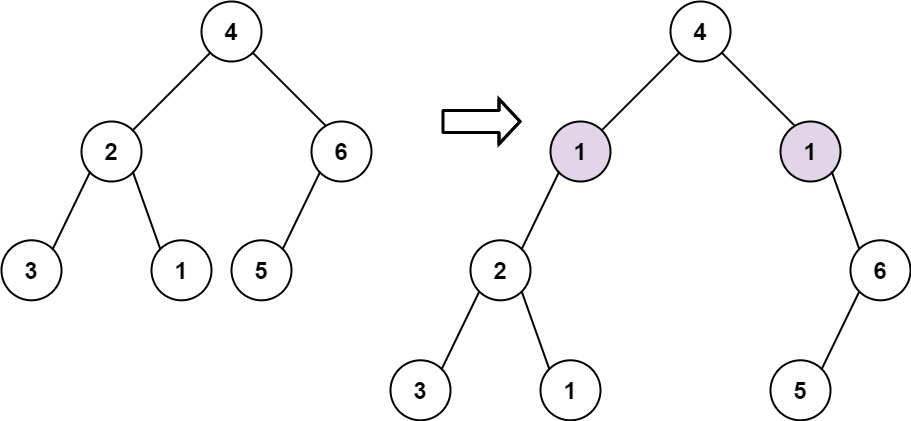

# PROBLEM STATEMENT

Given the root of a binary tree and two integers val and depth, add a row of nodes with value val at the given depth depth.

Note that the root node is at depth 1.

The adding rule is:

 - Given the integer depth, for each not null tree node cur at the depth depth - 1, create two tree nodes with value val as cur's left subtree root and right subtree root.
 - cur's original left subtree should be the left subtree of the new left subtree root.
 - cur's original right subtree should be the right subtree of the new right subtree root.
 - If depth == 1 that means there is no depth depth - 1 at all, then create a tree node with value val as the new root of the whole original tree, and the original tree is the new root's left subtree.
 
# EXAMPLE

Input: root = [4,2,6,3,1,5], val = 1, depth = 2
Output: [4,1,1,2,null,null,6,3,1,5]

# APPROACH

The idea is simple.

Traverse the tree until you reach a node that has a depth = depth - 1. At that point, we know we have to add two new nodes as the left and right children of this node with value = val. And then, we just need to attach the previous left and right subtrees accordingly.