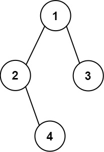

# PROBLEM STATEMENT

Given the root of a binary tree, construct a 0-indexed m x n string matrix res that represents a formatted layout of the tree. The formatted layout matrix should be constructed using the following rules:

 - The height of the tree is height and the number of rows m should be equal to height + 1.
 - The number of columns n should be equal to 2height+1 - 1.
 - Place the root node in the middle of the top row (more formally, at location res[0][(n-1)/2]).
 - For each node that has been placed in the matrix at position res[r][c], place its left child at res[r+1][c-2height-r-1] and its right child at res[r+1][c+2height-r-1].
 - Continue this process until all the nodes in the tree have been placed.
 - Any empty cells should contain the empty string "".

Return the constructed matrix res.

# EXAMPLE

Output: 
[["","","","1","","",""],
 ["","2","","","","3",""],
 ["","","4","","","",""]]

# APPROACH

There are two parts to this problem.

First, we have to find the height of the tree because based on that we can generate the initial output list and also get the correct row and column indices to put the values in the output list.

Once we do that, then we have to do the actual traversal where we take the values and put them at their correct indices in the output list.