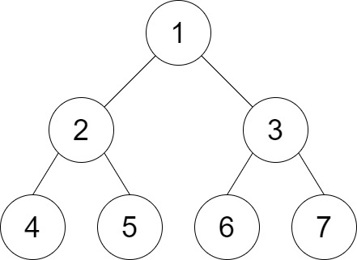

# PROBLEM STATEMENT

You are given the root of a binary tree and an integer distance. A pair of two different leaf nodes of a binary tree is said to be good if the length of the shortest path between them is less than or equal to distance.

Return the number of good leaf node pairs in the tree.

# EXAMPLE

Input: root = [1,2,3,4,5,6,7], distance = 3
Output: 2
Explanation: The good pairs are [4,5] and [6,7] with shortest path = 2. The pair [4,6] is not good because the length of ther shortest path between them is 4.

# NAIVE APPROACH

The idea is to traverse the tree and as soon as we reach a leaf node, we start traversing the rest of the tree, starting from that leaf node. And as we go over the nodes, we keep track of the distance from the leaf node. Since we need to traverse towards the parent, we also need to keep track of the parent of each node so for that we will traverse the tree initially and get that data in a dictionary.

If we find another leaf node that has distance <= "distance" then we know that we have a valid pair so we can increment the count.

Now, in the end, we will get the (number of pairs * 2) because the each pair will be counted twice. So, we just return the half of that as the final output.

# OPTIMAL APPROACH

The idea is that as we traverse the tree, each node will return a list of distances between itself and the leaf nodes beneath it.

Then, when we get the left and right leaf node distances for each node, we just need to find how many good pairs will be there.