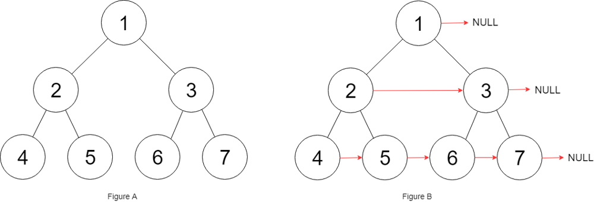

# PROBLEM STATEMENT

You are given a perfect binary tree where all leaves are on the same level, and every parent has two children. The binary tree has the following definition:

    struct Node {
        int val;
        Node *left;
        Node *right;
        Node *next;
    }

Populate each next pointer to point to its next right node. If there is no next right node, the next pointer should be set to NULL.

Initially, all next pointers are set to NULL.

# EXAMPLE

Input: root = [1,2,3,4,5,6,7]
Output: [1,#,2,3,#,4,5,6,7,#]

Explanation: Given the above perfect binary tree (Figure A), your function should populate each next pointer to point to its next right node, just like in Figure B. The serialized output is in level order as connected by the next pointers, with '#' signifying the end of each level.

# BFS APPROACH

The BFS solution is pretty straightforward. Just iterate over each level and then update the 'next' pointers accordingly.

# O(1) SPACE APPROACH

We do not even need to use extra space for this problem.

Since it is already given that the input tree will be a "Perfect" Binary tree, it means that no matter at what node we are, it is either the leaf node or it definitely has two children.

So, if we are at a node and it has a left child, it means this node also has a right child.

So, for the "left" child, the "next" pointer will point to the "right" child.

And similarly, if the node has a valid "next" pointer, then it means the "next" pointer of the "right" child will point to the "left" child of "node.next". Confusing? Let's take an example

Suppose we are at the node "2". We see that it has a left child so it means it also has a right child.
So, we update the "next" pointer of node "4" as the node "5".

And because node "2" also has a valid "next" pointer pointing to node "3", it means for the node "5", its next pointer will be the node "6", which is the left child of node "3".

And we need to repeat the same for all the nodes in the same level as node 2. So, after updating the next pointers of all the children of node 2, we will then move to the node 3 by simply doing "node = node.next".

And that's the whole idea.
