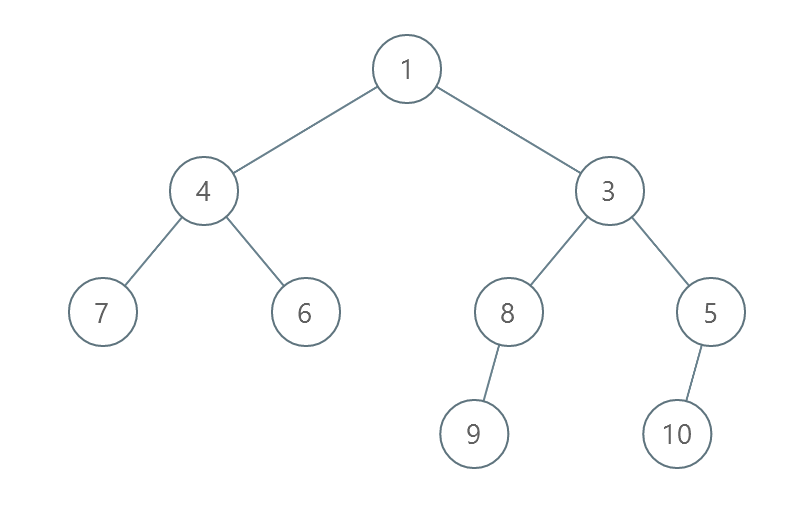

# PROBLEM STATEMENT

You are given the root of a binary tree with unique values.

In one operation, you can choose any two nodes at the same level and swap their values.

Return the minimum number of operations needed to make the values at each level sorted in a strictly increasing order.

The level of a node is the number of edges along the path between it and the root node.

# EXAMPLE

Input: root = [1,4,3,7,6,8,5,null,null,null,null,9,null,10]
Output: 3

Explanation:
- Swap 4 and 3. The 2nd level becomes [3,4].
- Swap 7 and 5. The 3rd level becomes [5,6,8,7].
- Swap 8 and 7. The 3rd level becomes [5,6,7,8].
We used 3 operations so return 3.
It can be proven that 3 is the minimum number of operations needed.

# APPROACH

The difficult part in this problem is not the BFS. It is the part where we have to efficiently find how many minimum swaps it would require to make values in a level strictly increasing.

So, just take the tree out of the equation for a moment and lets see how can we find the minimum swaps required if we are given a simple list or array.

## BRUTE FORCE SOLUTION

    Suppose we have [7,6,8,5]

    One way will be to stand at each index 
    and then see what is the smallest element on the right side and swap the two.

    So, we start with the element "7". We see that smallest is 5

    So, we swap and the list becomes [5,6,8,7]

    Then, we come to "6". There is no smallest element on right side. So, no swap required.
    This means "6" is at its correct place already.

    Then, we come to "8". We see that smallest on right is "7". So we swap the two

    The list becomes [5,6,7,8]

    And finally, we come to "8" and since there is no element on its right, we stop.

Hence, it took us "2" swaps to sort the list.
In the Brute Force solution, we will do the same process. We start from an index, and then we iterate the entire list on the right to find the smallest value and then swap the two. This will be an O(N^2) operation so not very efficient.

# MIN HEAP SOLUTION

What if we have a data structure that quickly gives us the smallest value among all? Well, we can use a Min Heap for that!

We can keep all the values of a level in a minHeap, along with their indices.

And at any time, for any index, the top of the minHeap should give us the smallest value on its right (assuming that we have already removed all the stale values from the top). And this will take the complexity from O(N^2) to O(NLogN). Just note that to remove stale values, we need some sort of a reference from where we can check if a value has the correct index or not in the heap. For that, we can use a dictionary.

Let's try this approach with the example above.

    Suppose we have [7,6,8,5]

    When we are done traversing the level, our minHeap will be like this from top to bottom -

        [[5,3], [6,1], [7,0], [8,2]]
        
    And our dictionary is like this - 

        {7 : 0, 6 : 1, 8: 2, 5: 3}
        
    So, we start from the index 0 in the list [7,6,8,5]

    At index 0, we have "7". So, we check what is the smallest value on its right.

    That will be the value on the top of the minHeap. 
    Since there is no stale value on top of the minHeap, it means the smallest on right is "5".

    So, we now have to swap the values.

    This means, we have to update the dictionary like this - 

        {5 : 0, 6 : 1, 8: 2, 7: 3}
        
    And since "5" is now at its correct place, 
    it means the only updated data we need to push to the heap is for "7"

    So, heap becomes [[5,3], [6,1], [7,0], [7,3], [8,2]]

    Note that we now have stale data in the heap. We will take care of that.

    Next, we come to the index "1".

    We first remove the stale values from the top of minHeap. 
    That is, all the values that are not having the same indices as in the dictionary.

    So, we remove [5,3] because as per dictionary the new index of "5" is "0".

    So, heap becomes [[6,1], [7,0], [7,3], [8,2]]

    So, for the index "1", the smallest on right is the value "6" at index "1".

    Since both indices are the same, it means no swap is required. 

    Since "6" is done, we remove it from the top of the heap as well.

    So, heap becomes [[7,0], [7,3], [8,2]]

    Next, we come to index "2'. Again, we remove stale data first.

    So, heap becomes [[7,3], [8,2]]

    Hence, for the index "2", the smallest on right is "7" at index "3".

    So, we swap the two indices and also update the dictionary accordingly.

    This means, we have to update the dictionary like this - 

        {5 : 0, 6 : 1, 8: 3, 7: 2}
        
    And heap becomes -
        
        [[7,3], [8,2], [8,3]]
        
    Finally, we reach the index "3". We first remove the stale data

    heap beomes [[8,3]]

    Since top of heap has index = 3 as well, it means no swap is needed.

    And we stop.

So, the total swaps required = 2.

## CYCLE SORT SOLUTION

If you note in the Heap approach, all that we are doing is taking each value and placing it at its correct index.

So, originally, we had [7,6,8,5] and finally, we got [5,6,7,8]

In other words, original indices were [0,1,2,3] and after placing at correct positions, the indices became [3,1,0,2].

So, what if we were given just this list -> [3,1,0,2] and we had to sort it?

Well, since we know that this list has values in the range 0 to n - 1, it means that a value "x" must be at the index "x". And all of this points towards one efficient algorithm named "Cycle Sort". This is an algorithm that is very useful when we have to sort values in a small range.

So, what we can do is that for each level, take the values and their original indices, and then sort them and get the indices after sorting.

That is, if we had values = [7,6,8,5] with their indices as 0, 1, 2 and 3 respectively, after sorting, the indices will be [3,1,0,2] since the list becomes [5,6,7,8]

And now, we just need to apply Cycle sort on [3,1,0,2] and increment the operations as we swap the indices.

So, we are just doing the opposite of what we did in Min Heap approach. Instead of placing the values at correct indices, we are simply sorting the indices first and then trying to get back the original order of indices ( That is, 0,1,2,3... and so on). Because in either case, the minimum number of swaps required will be the same.