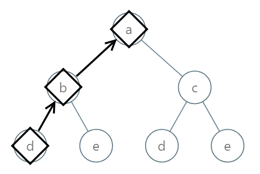

# PROBLEM STATEMENT

You are given the root of a binary tree where each node has a value in the range [0, 25] representing the letters 'a' to 'z'.

Return the lexicographically smallest string that starts at a leaf of this tree and ends at the root.

As a reminder, any shorter prefix of a string is lexicographically smaller.

    For example, "ab" is lexicographically smaller than "aba".
A
 leaf of a node is a node that has no children.

# EXAMPLE

Input: root = [0,1,2,3,4,3,4]
Output: "dba"

# APPROACH

The approach is simple. Just get the string from the root to the leaf, check if it is the smallest, and update the smallest string accordingly. Note that since we are taking the string from root to leaf, we have to reverse it if we have to update the smallest string because we are asked for the smallest string from leaf to root.
