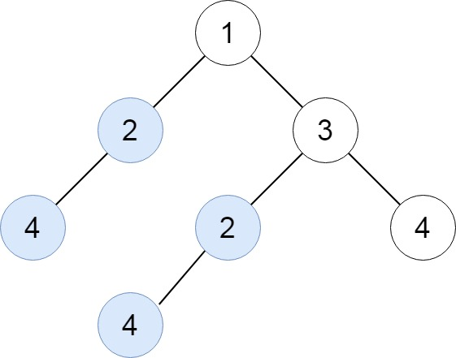

# PROBLEM STATEMENT

Given the root of a binary tree, return all duplicate subtrees.

For each kind of duplicate subtrees, you only need to return the root node of any one of them.

Two trees are duplicate if they have the same structure with the same node values.

# EXAMPLE

Input: root = [1,2,3,4,null,2,4,null,null,4]
Output: [[2,4],[4]]

# APPROACH

The idea is to traverse the tree and get the traversal result as a string. For each subtree, we will take the traversal result and put it in a dictionary (if it is not already present). If it is already present, that simply means we have more than one subtrees that have the same structure. And in that case, we will simply update the count in the dictionary.

In the end, we just need to pick all those root nodes from the dictionary that have count > 1.