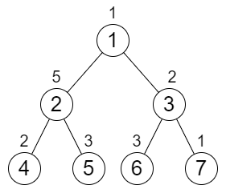
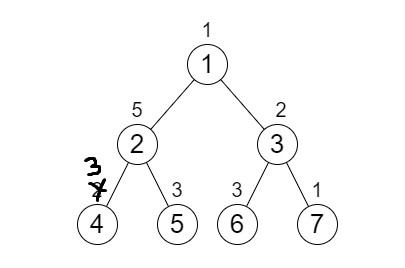
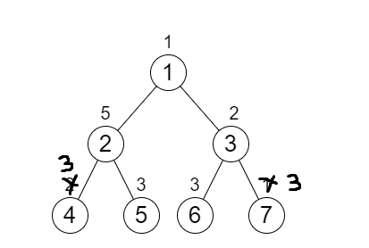
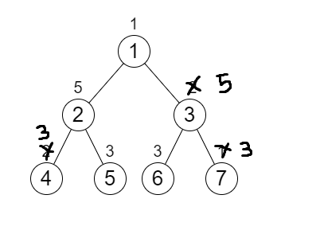

# PROBLEM STATEMENT

You are given an integer n representing the number of nodes in a perfect binary tree consisting of nodes numbered from 1 to n. The root of the tree is node 1 and each node i in the tree has two children where the left child is the node 2 * i and the right child is 2 * i + 1.

Each node in the tree also has a cost represented by a given 0-indexed integer array cost of size n where cost[i] is the cost of node i + 1. You are allowed to increment the cost of any node by 1 any number of times.

Return the minimum number of increments you need to make the cost of paths from the root to each leaf node equal.

Note:

    - A perfect binary tree is a tree where each node, except the leaf nodes, has exactly 2 children.
    - The cost of a path is the sum of costs of nodes in the path.

# EXAMPLE

Output: 6
Explanation: We can do the following increments:
- Increase the cost of node 4 one time.
- Increase the cost of node 3 three times.
- Increase the cost of node 7 two times.
Each path from the root to a leaf will have a total cost of 9.
The total increments we did is 1 + 3 + 2 = 6.

It can be shown that this is the minimum answer we can achieve.

# APPROACH

The idea is that, for the entire tree to have the same cost for each path from root to leaf, every subtree must also follow the same.

For example, in the above example, if we take the left subtree of this tree that has a root "2", we see that the path cost from "2" to "4" = 7 but the path cost from "2" to "5" = 8. And so, it means that to make the path costs the same, we need to increment the value of the node "4" from 2 to 3. This means one increment will have to be done.

Now, we see that the left subtree has the same path cost for all the leaf nodes. This also means that from the root node "1", it does not matter if we go to the leaf node "4" or the leaf node "5". The path cost will remain the same. That is => 9 (1 + 5 + 3)

We can do the same process for the right subtree. We see that the path sum from node "3" to node "6" = 5, But, the path sum from the node "3" to node "7" = 3. And to make the path costs for this subtree same, we need to increment the node "7" by 2.Hence, two more increments have to be made.

Finally, we then check the root node "1". We see that the path cost for left side = 9. But, the path cost for the right side = 6. It means, we need to increment the right side by "3".

And finally, the tree will be balanced.

So, in total, we had to make six increments. So, the output = 6.

Hence, we have to first start with the leaf nodes and then make our way to the root. This means, we have to do a Post Order traversal.

