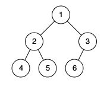

# PROBLEM STATEMENT

Given the root of a binary tree, determine if it is a complete binary tree.

In a complete binary tree, every level, except possibly the last, is completely filled, and all nodes in the last level are as far left as possible. It can have between 1 and 2h nodes inclusive at the last level h.

# EXAMPLE

Output: true
Explanation: Every level before the last is full (ie. levels with node-values {1} and {2, 3}), and all nodes in the last level ({4, 5, 6}) are as far left as possible.

# APPROACH

These are the conditions we need to ensure for a tree to be Complete -

    1. If any nodes does not have a left child, it cannot have a right child as well
    2. If any node does not have a right child, it means this right child should be the last node in its level. 
    In other words, no node after current node must have a child at all
    3. Finally, if current level is not the last level, it must be completely filled. That is, it must have (2^level) number of nodes