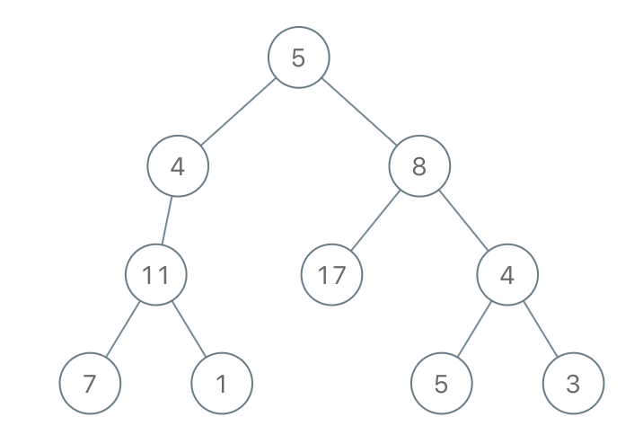

# PROBLEM STATEMENT

Given the root of a binary tree and an integer limit, delete all insufficient nodes in the tree simultaneously, and return the root of the resulting binary tree.

A node is insufficient if every root to leaf path intersecting this node has a sum strictly less than limit.

A leaf is a node with no children.

# EXAMPLE

Input: root = [5,4,8,11,null,17,4,7,1,null,null,5,3], limit = 22
Output: [5,4,8,11,null,17,4,7,null,null,null,5]

# APPROACH

The idea is that as we traverse the tree, we keep reducing the limit value based on the current root node's value and keep passing down the new limit value. When we reach the leaf node, the path from root to current leaf can be valid only if the leaf node's value is >= limit at that point. If it is not >= limit, we know that this is an invalid path so we return "None".

What if we are not yet at a leaf node?

In that case, if we see that the left recursive call is giving us "None", and so is the right recursive call, we know that all the root to leaf paths intersecting the current node are invalid so this current node itself needs to be removed hence, we will return "None" in that case as the result of previous recursive calls.