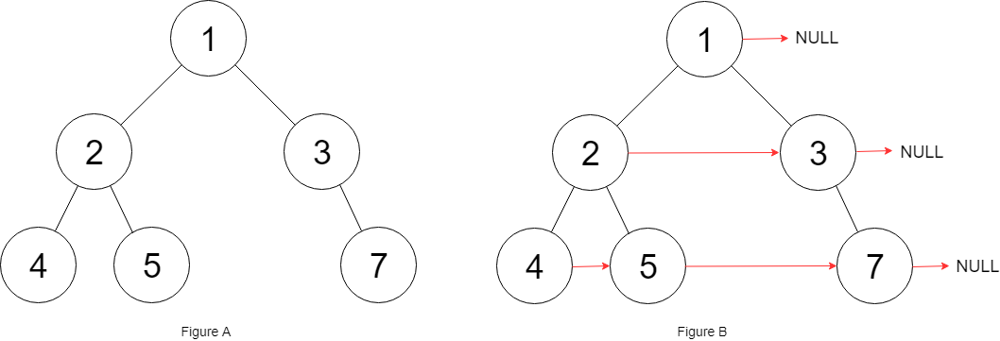

# PROBLEM STATEMENT

Given a binary tree

    struct Node {
        int val;
        Node *left;
        Node *right;
        Node *next;
    }

Populate each next pointer to point to its next right node. If there is no next right node, the next pointer should be set to NULL.

Initially, all next pointers are set to NULL,

# EXAMPLE

Output: [1,#,2,3,#,4,5,7,#]

Explanation: Given the above binary tree (Figure A), your function should populate each next pointer to point to its next right node, just like in Figure B. The serialized output is in level order as connected by the next pointers, with '#' signifying the end of each level.

# **1. BFS SOLUTION - EXTRA SPACE USED**
The idea is to traverse the tree level-wise, and then update the next right pointers accordingly. This exact same code works for **[116. Populating Next Right Pointers in Each Node](https://leetcode.com/problems/populating-next-right-pointers-in-each-node/)**

The issue is that we have to use a queue to keep track of nodes in each level, hence extra space is used. But, we can solve this problem without using extra space, just like **[116. Populating Next Right Pointers in Each Node](https://leetcode.com/problems/populating-next-right-pointers-in-each-node/)**

Here is the solution for the problem 116 -> https://leetcode.com/problems/populating-next-right-pointers-in-each-node/discuss/5201137/Python-Two-Solutions-or-Iterative-BFS-and-Iterative-O(1)-Space-Solution

# **2. O(1) SPACE SOLUTION**
The thing is, in the Problem "116", we were given a "Perfect" binary tree, meaning we knew that each node either had no children, or had two children. But, in current problem, we can have a tree where a node may or may not have any children and it is not present in the last level. This is what makes this problem a bit harder than the previous one.

But, the idea still remains the same when we update the next pointers. 

For each node, we want to update the next pointers of all its children before we move to the next node in current level. But since in current problem, we may not have a next node immediately after the current node, we have to first find a valid next node first. The "findNext" function does just that.