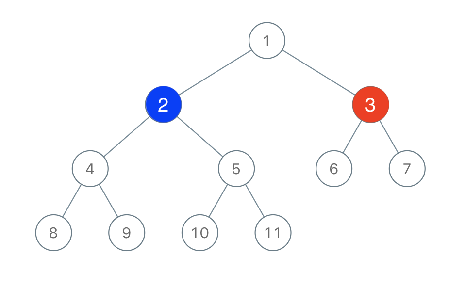

# PROBLEM STATEMENT

Two players play a turn based game on a binary tree. We are given the root of this binary tree, and the number of nodes n in the tree. n is odd, and each node has a distinct value from 1 to n.

Initially, the first player names a value x with 1 <= x <= n, and the second player names a value y with 1 <= y <= n and y != x. The first player colors the node with value x red, and the second player colors the node with value y blue.

Then, the players take turns starting with the first player. In each turn, that player chooses a node of their color (red if player 1, blue if player 2) and colors an uncolored neighbor of the chosen node (either the left child, right child, or parent of the chosen node.)

If (and only if) a player cannot choose such a node in this way, they must pass their turn. If both players pass their turn, the game ends, and the winner is the player that colored more nodes.

You are the second player. If it is possible to choose such a y to ensure you win the game, return true. If it is not possible, return false.

# EXAMPLE

Output: true
Explanation: The second player can choose the node with value 2.

# APPROACH

The idea is to keep track of the parent nodes of each node first.

Then, we will check how many nodes each subtree has which has root as the node which is the neighbor of the node that "x" selects initially.

For example, if in the above example, "x" selects the node "3" initially, then "y" has three choices. It can either select node "1" or it can select node "6" or it can select node "7".

The reason why we want "y" to select neighbors of node "3" is because that will ensure that "y" will get that entire subtree to itself and hence all the nodes. So, if we know the count of nodes in each of these three subtrees rooted at "1", "6" and "7", we can know if "y" has a chance to win or not.

For example, for the tree with root as "1", the number of nodes are 8 (1,2,4,5,8,9,10,11)
For the tree with root as "6", the number of nodes are 1 (6)
For the tree with root as "7", the number of nodes are 1 (7)

And we see that one subtree has more nodes than other two. It means, if "y" selects the root of this first subtree, then it ensures that "y" will win. Because then, "y" will get all the "8" nodes to itself, whereas "x" will get only 2 more nodes.

And that's the whole idea.