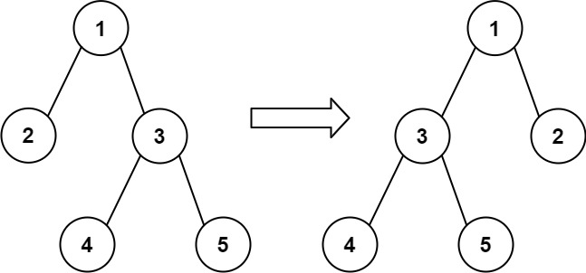
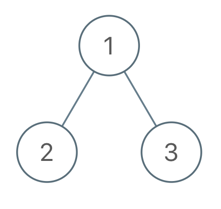

# PROBLEM STATEMENT

ou are given the root of a binary tree with n nodes, where each node is uniquely assigned a value from 1 to n. You are also given a sequence of n values voyage, which is the desired pre-order traversal of the binary tree.

Any node in the binary tree can be flipped by swapping its left and right subtrees. For example, flipping node 1 will have the following effect:

Flip the smallest number of nodes so that the pre-order traversal of the tree matches voyage.

Return a list of the values of all flipped nodes. You may return the answer in any order. If it is impossible to flip the nodes in the tree to make the pre-order traversal match voyage, return the list [-1].

# EXAMPLE

root = [1,2,3], voyage = [1,3,2]
Output: [1]
Explanation: Flipping node 1 swaps nodes 2 and 3, so the pre-order traversal matches voyage.

# APPROACH

The idea is to traverse the tree recursively in pre-order traversal and keep track of the current value in "voyage" list. We want the current value to match the current node that we are traversing. If it is not same, it means we cannot flip the nodes to match the preorder traversal of "voyage".

But, if current node is same as the node in "voyage", then we will check the next node. That is, what is the next value in "voyage" list. It should be the same as the "left" child of the current node, if the left child exists. If it is not, it simply means we have to flip the current node.

And that's how we know when to flip the nodes.

And when we flip the nodes, we know the right child becomes the left and left child becomes the right. So, instead of actually flipping the whole subtrees, we can just call the DFS function in this way - 

    dfs(right) -> For left child (since "right" is now the new "left")
    dfs(left) -> For right child (since "left" is now the new "right")

If the left child has same value as next value in "voyage", then we know that no flip is needed for current node. And since we did not flip the children, we make the recursive calls as we do in normal DFS - 

    dfs(left) -> For left child
    dfs(right) -> For right child
 