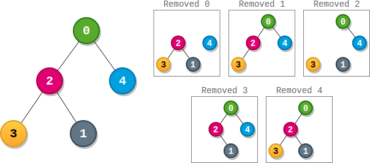

# PROBLEM STATEMENT

There is a binary tree rooted at 0 consisting of n nodes. The nodes are labeled from 0 to n - 1. You are given a 0-indexed integer array parents representing the tree, where parents[i] is the parent of node i. Since node 0 is the root, parents[0] == -1.

Each node has a score. To find the score of a node, consider if the node and the edges connected to it were removed. The tree would become one or more non-empty subtrees. The size of a subtree is the number of the nodes in it. The score of the node is the product of the sizes of all those subtrees.

Return the number of nodes that have the highest score.

# EXAMPLE

Input: parents = [-1,2,0,2,0]
Output: 3

Explanation:
- The score of node 0 is: 3 * 1 = 3
- The score of node 1 is: 4 = 4
- The score of node 2 is: 1 * 1 * 2 = 2
- The score of node 3 is: 4 = 4
- The score of node 4 is: 4 = 4
The highest score is 4, and three nodes (node 1, node 3, and node 4) have the highest score.

# APPROACH

The idea is to first count how many nodes each node has on its left and right. This information will be helpful when we have to get the score of a node.

If you look at the above example, whenever we remove any node from the tree, its score is simply the product of 

	nodesOnLeft * nodesOnRight * nodesOnTop
	
To get the nodes on left and nodes on right, we can simply traverse the tree in DFS (Post Order) and then get the count and save it somewhere.

For the top, it is pretty simple. If we know how many nodes are on the left and right, we can say that the nodes on top will be - 

	Total Nodes - (nodesOnLeft + 1 + nodesOnRight)

And well, the last thing remaining will be to find the highest score and the count of nodes with that score.