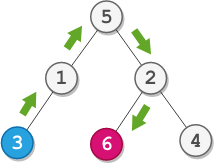

# PROBLEM STATEMENT

You are given the root of a binary tree with n nodes. Each node is uniquely assigned a value from 1 to n. You are also given an integer startValue representing the value of the start node s, and a different integer destValue representing the value of the destination node t.

Find the shortest path starting from node s and ending at node t. Generate step-by-step directions of such path as a string consisting of only the uppercase letters 'L', 'R', and 'U'. Each letter indicates a specific direction:

 - 'L' means to go from a node to its left child node.
 - 'R' means to go from a node to its right child node.
 - 'U' means to go from a node to its parent node.

Return the step-by-step directions of the shortest path from node s to node t.

# EXAMPLE

Output: "UURL"
Explanation: The shortest path is: 3 → 1 → 5 → 2 → 6.

# **1. BRUTE FORCE SOLUTION - TLE**

This is the most basic approach to this problem where we first get hold of the "startNode", and then, we traverse every single path from that node to any other node until we reach the "destNode". Ofcourse this is not a very efficient solution as we are traversing every single path and hence, we get TLE.

But from this, we can try to write an efficient solution.

# **2. LCA SOLUTION**
Remember this tree problem - [236. Lowest Common Ancestor of a Binary Tree](https://leetcode.com/problems/lowest-common-ancestor-of-a-binary-tree/)

The Lowest Common Ancestor of any two nodes is the lowest node that has both the nodes as its descendents. And whatever the path is between the two nodes, it will go through the Lowest Common Ancestor only.

This means, if we know the lowest common ancestor of nodes with "startValue" and "destValue" values, then we can easily find what is the path from "startNode" to "destNode". Because, then, we do not have to go over every single path from the "startNode" since we know that path should go through the LCA node.

So, if "lca" is the lowest common ancestor of "startNode" and "destNode", it means, the path from "startNode" to "destNode" will be - 

	path from startNode to lca + path from lca to destNode
	
Moreover, the LCA will always be present above the "startNode" (Or it will be the startNode itself). It means, the path from the "startNode" to the "lca" will simply depend on how many nodes are between them. So, if there are two nodes, then path will be "UUU".

As for the path between the "lca" and "destNode", that's pretty simple as we have seen a lot of tree problems where we have to find the path between two nodes.

