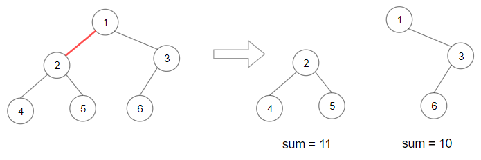

# PROBLEM STATEMENT

Given the root of a binary tree, split the binary tree into two subtrees by removing one edge such that the product of the sums of the subtrees is maximized.

Return the maximum product of the sums of the two subtrees. Since the answer may be too large, return it modulo 109 + 7.

Note that you need to maximize the answer before taking the mod and not after taking it.

# EXAMPLE

Output: 110
Explanation: Remove the red edge and get 2 binary trees with sum 11 and 10. Their product is 110 (11*10)

# APPROACH

Whenever we are at a node, there are basically one of the two edges that we can remove - The left edge or the right edge. Why not the top edge? Because that will be taken care of the parent node because the top edge of current node is simply the left or right edge of the parent node.

Now, for any node, if we remove the left edge, then there will be two separate subtrees. One that is rooted at the left child, and then there is the remaining tree. And same if we remove the right edge.

So, our recursive function will give us the left and right subtree sums for any node. Then, we can simulate removing the edges.

First we remove the left edge which means now, there are two subtrees. One that is rooted at the left child, hence has a sum equal to the "leftSum". And the other subtree is simply having sum equal to "Total Sum of the tree - leftSum".

Similarly, we remove the right edge and it means now, there are again two subtrees. One that is rooted at the right child, hence has a sum equal to "rightSum". And the other subtree is simply having a sum equal to "Total Sum of the tree - rightSum".

And we then need to update the maxProduct accordingly.

That is pretty much it!