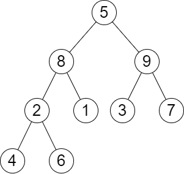

# PROBLEM STATEMENT

You are given the root of a binary tree and a positive integer k.

The level sum in the tree is the sum of the values of the nodes that are on the same level.

Return the kth largest level sum in the tree (not necessarily distinct). If there are fewer than k levels in the tree, return -1.

Note that two nodes are on the same level if they have the same distance from the root.

# EXAMPLE

Output: 13
Explanation: The level sums are the following:
- Level 1: 5.
- Level 2: 8 + 9 = 17.
- Level 3: 2 + 1 + 3 + 7 = 13.
- Level 4: 4 + 6 = 10.
The 2nd largest level sum is 13.

# APPROACH

Pretty straightforward solution. Just keep track of the level sum for each level and at the end, get the kth largest sum. We can use a Min Heap for that.
