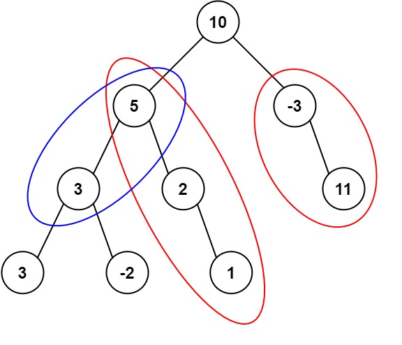

# PROBLEM STATEMENT

Given the root of a binary tree and an integer targetSum, return the number of paths where the sum of the values along the path equals targetSum.

The path does not need to start or end at the root or a leaf, but it must go downwards (i.e., traveling only from parent nodes to child nodes).

# EXAMPLE

Output: 3
Explanation: The paths that sum to 8 are shown.

# APPROACH

This solution will be super easy to understand but only if you have done a problems like these -

1. https://leetcode.com/problems/continuous-subarray-sum/
2. https://leetcode.com/problems/subarray-sums-divisible-by-k/
3. https://leetcode.com/problems/subarray-sum-equals-k/

The reason is that the idea to find the count of paths is the same as these problems. Here, every root to leaf path can be considered as a separate list so it means we then have to simply count how many subarrays are there that have sum equal to the "targetSum".

And if you have done the problems above, you will know that we can use the prefix sum along with the dictionary / hashmap to find that quickly.

The general idea is that on any path that we are currently on, if we have a path sum as "x", and we know that on this same path, we did have a sub-path that had a path sum as "x - target", then it means if we exclude that path from the path so far, then the remaining path will have sum equal to "target".

Take the above tree as an example. Assume that we start from the node "10". The path sum right now is "10" but we need "8". 

When we reach the node "5", the path sum becomes "15" but we need "8".

When we reach the node "3", the path sum becomes "18" but we need "8".

Now, we see that even though current path from node "10" to "3" has a sum equal to "18", if we exclude the node "10" from this path, the remaining sum becomes "8" which is the target sum.

And that's exactly what the dictionary will tell us. We keep track of the path sums as we go over all the nodes in a path and add that data to the dictionary along with the count (Since there can be multiple paths with the same path sum in case of negative numbers in the path).

Then, at any point, if path sum is not target, we check if we have a sub-path in the current path that has a sum equal to "x - target". If yes, it means we can definitely have a sub-path that has sum equal to target in the current path so far. And we will increment the count by the number of times the "x - target" path sum appears in the current path so far.

And that's the whole idea!
