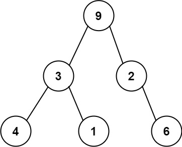

# PROBLEM STATEMENT

One way to serialize a binary tree is to use preorder traversal. When we encounter a non-null node, we record the node's value. If it is a null node, we record using a sentinel value such as '#'.

For example, the above binary tree can be serialized to the string "9,3,4,#,#,1,#,#,2,#,6,#,#", where '#' represents a null node.

Given a string of comma-separated values preorder, return true if it is a correct preorder traversal serialization of a binary tree.

It is guaranteed that each comma-separated value in the string must be either an integer or a character '#' representing null pointer.

You may assume that the input format is always valid.

    - For example, it could never contain two consecutive commas, such as "1,,3".

Note: You are not allowed to reconstruct the tree.

# APPROACH
The idea is pretty simple.

We will us a stack to keep track of the nodes as we traverse them so that at any point, we can easily check the previous nodes.

For each node, we will keep a flag in the stack which shows whether we have found the left child or not. For current node, if the stack is not empty and the previous node in stack does not yet have a left child, then we update its flag to True and continue with our traversal.

But, if we have already found the left child of the previous node, it means the current node is the right child and this means we have traversed both the left and right children of the previous node so we no longer have to keep it in the stack.

In this way, for a valid preorder serialization, the stack will eventually be empty.

