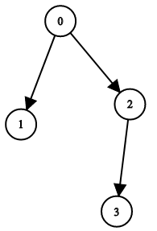

# PROBLEM STATEMENT

You have n binary tree nodes numbered from 0 to n - 1 where node i has two children leftChild[i] and rightChild[i], return true if and only if all the given nodes form exactly one valid binary tree.

If node i has no left child then leftChild[i] will equal -1, similarly for the right child.

Note that the nodes have no values and that we only use the node numbers in this problem.

# EXAMPLE

Input: n = 4, leftChild = [1,-1,3,-1], rightChild = [2,-1,-1,-1]
Output: true

# **1. FIND THE ROOT & DO BFS**

If we are able to find what is the root node, then we just need to simply do a BFS traversal and if we can do a valid BFS traversal based on the given lists, then the tree is a valid Binary Tree.

# **2. SIMPLY USE A DICTIONARY**
This one is simpler but not very easy to write because there will be a lot of edge cases to cover. The basic points to note are - 

	1. A node cannot be the child of itself
	2. The grandparent of a node (parent of the parent) cannot be its child
	3. A child of the node cannot be its parent
	4. A node can only have one parent

If the given tree follows these rules, then it is a Valid Binary Tree.
