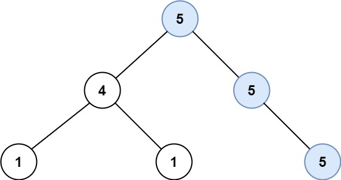
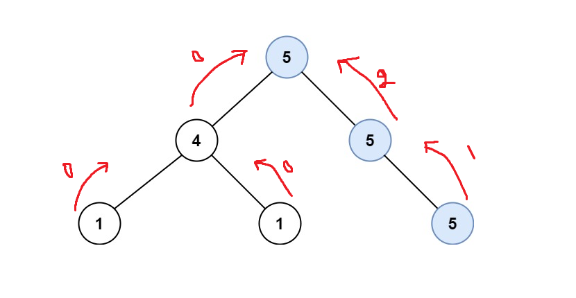

# PROBLEM STATEMENT

Given the root of a binary tree, return the length of the longest path, where each node in the path has the same value. This path may or may not pass through the root.

The length of the path between two nodes is represented by the number of edges between them.

# EXAMPLE

Output: 2
Explanation: The shown image shows that the longest path of the same value (i.e. 5).

# APPROACH

This is a very good problem to practice Recursion on trees. 

Let's say that "dfs" is a recursive function that takes the root node of current tree, the value of the parent node and the longest path that we have found so far (so that we can update it when needed). Whenever we call this function on any subtree with some "val" value, it will give us what is the longest path from the root down to any node such that all the nodes in that path have value = "val". 

So, now that we have defined our function, we can write the same in code.

So, when we are at any node, we will use this function to get the longest path on left and longest path on right where that path goes through the root node and all nodes have same values.

In this way, the overall path for that node will be "leftPath + rightPath".

For example, in the above image, if we are at the root node "5", then our recursive function should give us the leftPath as "0" because there is not even a single node that is connected to the root node "5" which has the same value.

The rightPath should be returned as "2" because there are two nodes that have same value as root node and they are both connected to each other one after the other and also to the root node. So, this entire path on right is univalue.

And hence, for the root node "5", the longest univalue path will be "0 + 2" => 2

This is what we need to write in the code.

The most difficult part to understand in the code is the "return" statement at the end of the recursive function. Because apart from that, everything is same as what we discussed above.

Let's go over the entire tree and see how this works.

We start with the root node "5" and make a recursive call for left side. 

We come to the node "4". Again, we make a recursive call for left side.

We come to the node "1". And again, we make a recursive call for left side.

Now, we reach a "Null" node and as our base condition tells, we will return 0.

Then, from node "1", we make a recursive call for right side. Again, 0 will be returned.

And so, for the node "1", which is a leaf node, the leftPath is 0 and rightPath is 0. So, longest path remains unchanged.

Now, once we are done with this leaf node "1", we need to return back something that will be used by node "4". Since we can see that "1" is not same as "4", it means there is no univalue path so we will return 0.

Same happens with the other leaf node "1".

And so, when we are at the node "4", leftPath is 0 and rightPath is 0 and again, longest path remains unchanged.

Now, from "4", we again need to return something back to the node "5". Since we see that "4" is not same as its parent "5", we return 0 which means path from "5" to "4" is not a univalue path.

Now, the "left" recursive call for "5" is complete an we got the leftPath as 0.

It's time for the "right" recursive call.

We first reach the node "5". And from here, we again make left and right recursive calls.

The left recursive call will give us 0 since there is no node on left.

When we make a right recursive call, we reach another node with value "5".

Since it is a leaf node, its left and right recursive calls will give us 0.

But, when we have to return something back for the parent node "5", we won't return 0. That's because we see that "5" is same as "5" so this is a valid univalue path from parent to current node. And so, we will return -

	1 + max(leftPath, rightPath)
	
We return the max because we cannot return the entire path from left to right. The path that we are returning should go through the parent "5".

So, when we are at the middle node "5", the right recursive call returns "1". 

And before returning we also update the longest path to "1"

So, from this, what do we return? We see that parent is "5" as well. So again, we return - 

	1 + max(leftPath, rightPath)
	
That is, 1 + max(0, 1) => 1 + 1 => 2

So, we update the longest path to 2.

And in this way, the root node "5" will receive the value "2".

And finally, all the calls complete and the longest path is "2".