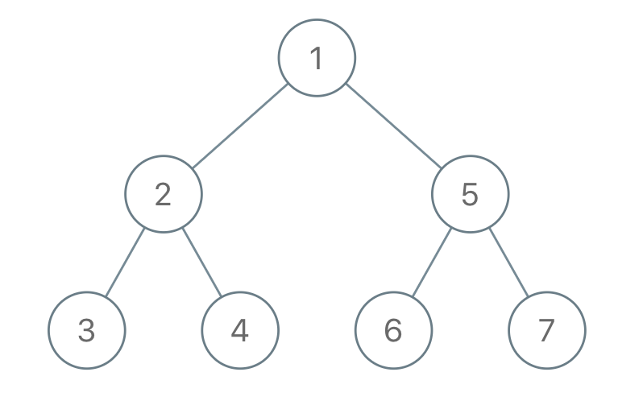

# PROBLEM STATEMENT

We run a preorder depth-first search (DFS) on the root of a binary tree.

At each node in this traversal, we output D dashes (where D is the depth of this node), then we output the value of this node.  If the depth of a node is D, the depth of its immediate child is D + 1.  The depth of the root node is 0.

If a node has only one child, that child is guaranteed to be the left child.

Given the output traversal of this traversal, recover the tree and return its root.

# EXAMPLE

Input: traversal = "1-2--3--4-5--6--7"
Output: [1,2,5,3,4,6,7]

# APPROACH

I could relate this problem with this problem I did recently -> https://leetcode.com/problems/verify-preorder-serialization-of-a-binary-tree/discuss/5366594/python-easy-to-understand-stack-solution-explained

The idea is similar in current problem. We just need a stack to keep track of the nodes, their depths and a flag indicating whether we have found the left child for that node or not. In this way, it becomes really easy to keep track of when to remove nodes from top of stack. 

Let's do a dry run and see how this stack solution works.

	traversal = "1-2--3--4-5--6--7"

So, we start with the first value which is "1" and since it does not have any dash before it, it means this is at the depth 0 and hence, it is the root node.

We push a triplet in the stack for this node -> [node, depth, flag to indicate if we have found its left child]

Hence, the stack will become -

	[[node 1, 0, False]]
	
Next, we have the value as "2" and since there is a single dash before it, it is at a depth of "1". We see that the node on top of stack is the node "1" which does not have a left child yet. And so, it means the node "2" should be the left child of node "1". Hence, we update the flag for the node "1" to True and also push the node "2" in the stack.

Now, the stack becomes - 
	
	[[node 1, 0, True], [node 2, 1, False]]
	
Next, we have value as "3" and it is at a depth of "2". We see that the node on top of stack is the node "2" which does not have a left child yet. And so, it means the node "3" should be the left child of node "2". Hence, we update the flag for the node "2" to True and also push the node "3" in the stack.

Now, the stack becomes - 
	
	[[node 1, 0, True], [node 2, 1, True], [node 3, 2, False]]
	
Next, we have the value as "4" which is also at the depth of "2". We see that the node on top of stack is node "3" with a depth of "2" as well. And since both have same depths, ofcourse the node "4" cannot be a child of node "3". This means, the node "3" does not need to be in stack anymore because it has no children. So, we will pop all those nodes from top of stack that have a depth greater or equal to the depth of current node.
	
Now, the stack becomes -

	[[node 1, 0, True], [node 2, 1, True]]
	
And now, we do the same thing. That is, we see if the node on top of stack has a left child or not. Since for the node 2, the flag is True, it means we already have a left child for this node so the node "4" must be its right child.

And since we now have both the left and right children for node 2, it does not need to be in the stack as well. So, we pop the node 2 from stack and then we push node 4.

Now, the stack becomes - 
	
	[[node 1, 0, True], [node 4, 2, False]]
	
Next, we have the value "5" which is at a depth of "1". We will remove the node "4" from the stack because it is at a greater depth than current value. So, stack becomes - 

	[[node 1, 0, True]]
	
And it means, the node "5" must be the right child of node 1 since node 1 already has a left child. And since node 1 now has both left and right children, it can be removed from the stack as well.

And now, we push the node "5" in the stack.

Stack becomes -

	[[node 5, 1, False]]
	
Next, we have the value "6" which is at a depth "2". We see that the node on  top of stack has a depth 1 so it is not removed. Moreover, the node on top of stack does not have a left child so the node "6" will be the left child of node "5".

Stack becomes - 

	[[node 5, 1, True], [node 6, 2, False]]
	
Next, we have the value "7" which is at a depth of "2". Since the top of stack has node 6 which is at same depth, it is removed from stack. And now, the node 7 becomes the right child of node 5 because we have already found the left child.

And the node 5 is also removed from stack since we found both its children.

So, finally, the stack becomes - 

	[[node 7, 2, False]]
	
And the loop ends.

And finally, we return the root node.