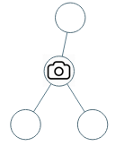

# PROBLEM STATEMENT

You are given the root of a binary tree. We install cameras on the tree nodes where each camera at a node can monitor its parent, itself, and its immediate children.

Return the minimum number of cameras needed to monitor all nodes of the tree.

# EXAMPLE

Output: 1
Explanation: One camera is enough to monitor all nodes if placed as shown.

# APPROACH

The idea is to start adding cameras from bottom and go all the way to the top. In other words, we will traverse the tree using the Post Order Traversal.

Whenever we are at a node, there are only two situations -

  1. If this node has a parent, then we know that the ideal place to add a camera is at the parent because it ensures that it covers the maximum number of nodes around it.
  2. If this node does not have a parent, then we can simply add a camera to this node itself

And that's pretty much it.

If we add a camera to the "parent" node, then we know that this camera will monitor the left child, the right child and also the parent of parent (grandParent of current node).