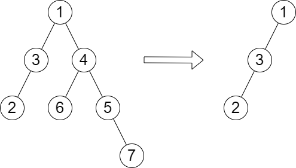
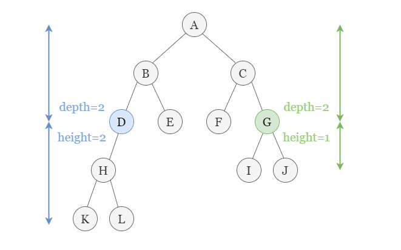
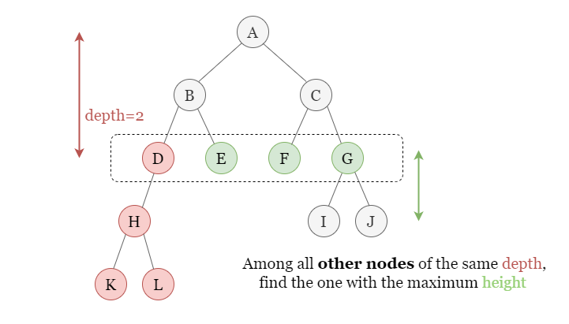
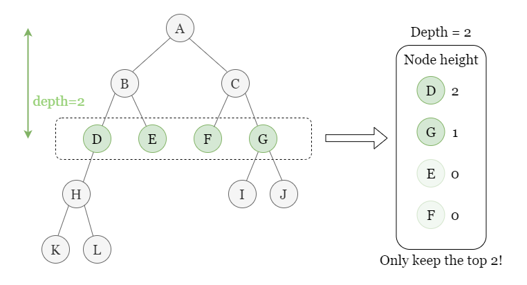

# PROBLEM STATEMENT

You are given the root of a binary tree with n nodes. Each node is assigned a unique value from 1 to n. You are also given an array queries of size m.

You have to perform m independent queries on the tree where in the ith query you do the following:

    - Remove the subtree rooted at the node with the value queries[i] from the tree. It is guaranteed that queries[i] will not be equal to the value of the root.

Return an array answer of size m where answer[i] is the height of the tree after performing the ith query.

Note:

    - The queries are independent, so the tree returns to its initial state after each query.
    - The height of a tree is the number of edges in the longest simple path from the root to some node in the tree.

# EXAMPLE

queries = [4]
Output: [2]
Explanation: The diagram above shows the tree after removing the subtree rooted at node with value 4.
The height of the tree is 2 (The path 1 -> 3 -> 2).

# APPROACH

Credits to this explanation -> https://leetcode.com/problems/height-of-binary-tree-after-subtree-removal-queries/discuss/2757990/Python-3-Explanation-with-pictures-DFS

The idea is that, if we remove any node from the tree, then the height of the remaining tree will be the maximum height among all the other nodes that are in the same level as the removed node.

And so, all we need to know is for each level, what are the two maximum height values because we know that if one is removed, then the other will become the new maximum height.

It is important to understand the difference between the height and the depth/level.

For example, in the above tree, root node of a tree is at a depth of 0 (level = 0). But, when we talk about height, the height of the tree is "4" because there are four sublevels after the root node's level. So, we can say that the longest path passing through this root node is level + height or "0 + 4" => 4

Similarly, for any subtree rooted at a node "x", if we know the height of that subtree and the level at which the "x" lies, then we can say that the longest path's length that passes through "x" will be "level + height" or "depth + height".

And this longest path is what we have to find after we remove a node from the tree.

Suppose we remove the node "D" from above tree. Then, it means any path that went through "D" is no longer valid. We have to find a new longest path and it is obvious that this new longest path will go through either "E" or "F" or "G". That is, the nodes at the same level (Cousins).

If there were no cousins at all, then it would've meant that the new longest path is simply the path from root to parent.

And so, the idea is to go over each level and keep track of the two longest path lengths for that level.

And in this way, we can quickly get the answer for each query in O(1) time since we have precomputed everything.